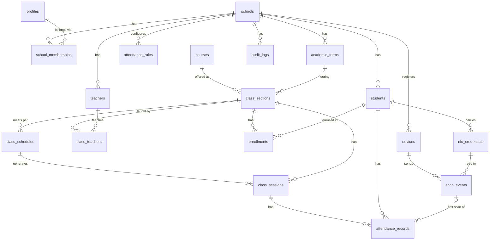

# School Attendance SaaS — Architecture (v0.2)

Status: **approved; Phase 1 implemented** (see §7 and §8 for what was built and
the decisions taken).

Scope: a multi-school (multi-tenant) SaaS that records class attendance from
NFC card taps. Physical readers come later; for now scans are simulated, but
they go through the exact same API and engine that readers will use.

Stack: Next.js (App Router, TypeScript) on Vercel · Supabase (Postgres, Auth,
RLS, Realtime, pg_cron) · GitHub.

---

## 1. Architecture

### 1.1 High-level view

```
                ┌──────────────────────────── Vercel ─────────────────────────────┐
 Browser        │  Next.js app                                                     │
 (admin,        │                                                                  │
  teacher,  ───►│  UI routes (RSC + Server Actions)                                │
  student)      │     │  user-scoped Supabase client (JWT from cookie → RLS on)    │
                │     ▼                                                            │
 NFC simulator ►│  POST /api/v1/attendance/scans  ◄──────── future NFC readers     │
 (dev page)     │     │  1. authenticate caller → ScanContext {school, device}     │
                │     │  2. AttendanceEngine.processScan(ctx, input)  ◄── ONE path │
                │     ▼                                                            │
                │  src/server/attendance/*   (pure rules + repository)             │
                └─────┼────────────────────────────────────────────────────────────┘
                      ▼
      ┌──────────────────── Supabase ─────────────────────┐
      │ Auth (email/password, magic link; SSO later)      │
      │ Postgres: tenant tables, RLS, constraints,        │
      │           audit triggers, SECURITY DEFINER RPCs   │
      │ pg_cron: generate sessions, finalize absences     │
      │ Realtime: attendance_records → teacher screen     │
      └───────────────────────────────────────────────────┘
```

### 1.2 Key decisions

| Decision | Choice | Why |
|---|---|---|
| App shape | **One Next.js app** (route groups per role), not a monorepo | One deployable, one auth surface. Split out only if a second client (e.g. a reader bridge) needs shared packages. |
| Where business logic lives | `src/server/**` (marked `server-only`), called by Server Actions and Route Handlers | UI never talks to the DB for writes; every write passes a server authorization check. |
| Tenancy model | **Shared database, shared schema, `school_id` on every tenant row** + RLS + composite foreign keys | Standard for SaaS at this scale; cheap; isolation enforced by the database, not just app code. |
| Attendance correctness | Rule evaluation in pure TypeScript (unit-testable); **correctness guarantees in Postgres** (unique constraints, `ON CONFLICT`, transactions inside RPCs) | Two simultaneous taps can't create two records no matter what the app does. |
| DB access from the server | Two clients: **user client** (anon key + user JWT, RLS applies) for everything a human does; **service client** (service-role key) only for the scan ingestion path and scheduled jobs | Service role bypasses RLS, so it is confined to code paths where the tenant is derived from a verified credential, never from input. |
| Live teacher view | Supabase Realtime `postgres_changes` on `attendance_records`, filtered by `class_session_id` (RLS applies to Realtime) | No custom websocket infra; polling fallback is trivial. |
| Scheduled work | **pg_cron** inside Supabase (session generation, absence finalization) | Vercel Hobby cron only runs daily; pg_cron runs every minute next to the data. |
| Validation | `zod` schemas at every API/Server Action boundary | One schema per contract, shared with the simulator form. |
| Environments | Separate Supabase projects for `dev`/`staging` and `prod`; Vercel preview deployments point at staging | Never test the simulator against production data. |

### 1.3 Where the code lives

The product lives in the `attendance/` folder of this repository, fully
independent of TaskSwift (own `package.json`, npm lockfile, Supabase
migrations and CI workflow). It can be moved to a dedicated repository later
with `git subtree split --prefix=attendance` without losing history. It must
use its **own Supabase projects**, never TaskSwift's.

---

## 2. Database schema

### 2.1 Conventions

* Every tenant-owned table has `school_id uuid not null references schools`.
* Every tenant table also has `unique (school_id, id)` so children can use
  **composite foreign keys** `(school_id, parent_id) → parent(school_id, id)`.
  This makes it *structurally impossible* for, say, an enrollment in School A
  to point at a student in School B — even if app code has a bug or the
  service role is used.
* `id uuid default gen_random_uuid()`, `created_at`/`updated_at timestamptz`.
* All instants stored as `timestamptz` (UTC). Each school has an IANA
  `timezone`; local wall-clock times (schedules) are converted using it.
* Soft-delete/deactivation (`status`, `archived_at`) instead of hard deletes
  for anything referenced by attendance history.
* Enums as Postgres enums (or check constraints) — listed below.

### 2.2 Entity-relationship overview



### 2.3 Tables

**Tenancy & identity**

| Table | Key columns | Notes |
|---|---|---|
| `schools` | `id, name, slug (unique), timezone, locale, status (active/suspended), settings jsonb` | The tenant. `settings.simulator_enabled` lives here. |
| `profiles` | `id = auth.users.id, full_name, email, is_platform_admin bool` | 1:1 with Supabase Auth user. No school/role here. |
| `school_memberships` | `school_id, user_id → profiles, role (school_admin/teacher/student), status (active/invited/disabled)`; `unique(school_id, user_id, role)` | **The only source of truth for roles.** Per school, so one person can be a teacher in two schools, or admin + teacher in one. |

**People**

| Table | Key columns | Notes |
|---|---|---|
| `students` | `school_id, user_id (nullable), student_number, first_name, last_name, grade_level, status (active/inactive/graduated)`; `unique(school_id, student_number)` | Login is optional — young students may never have accounts. |
| `teachers` | `school_id, user_id (not null), employee_number, first_name, last_name, status`; `unique(school_id, user_id)` | Linked to a `teacher` membership. |

**Academic structure**

| Table | Key columns | Notes |
|---|---|---|
| `academic_terms` | `school_id, name, starts_on, ends_on` | Bounds for schedule generation and reporting. |
| `courses` | `school_id, code, name, description`; `unique(school_id, code)` | The subject ("Math 7"). |
| `class_sections` | `school_id, course_id, term_id, name, room, attendance_rule_id (nullable override), status` | "The class" a teacher teaches and students enroll in. |
| `class_teachers` | `school_id, class_section_id, teacher_id, role (primary/assistant/substitute), valid_from, valid_to` | Many-to-many; supports substitutes. |
| `enrollments` | `school_id, class_section_id, student_id, enrolled_on, withdrawn_on (nullable), status`; partial unique on active `(class_section_id, student_id)` | Dated, so a student who joined on Oct 3 is not marked absent for Sept sessions. |
| `class_schedules` | `school_id, class_section_id, weekday (1–7), start_time, end_time, valid_from, valid_to, room` | Recurring *rule* in school-local time. |
| `class_sessions` | `school_id, class_section_id, schedule_id (nullable), starts_at, ends_at (timestamptz), status (scheduled/cancelled/completed), attendance_rule_snapshot jsonb, finalized_at` | Concrete occurrences, generated ~14 days ahead by a job; one-off sessions allowed (`schedule_id` null). Attendance hangs off these. Index `(school_id, starts_at)`. |

**Attendance configuration & hardware**

| Table | Key columns | Notes |
|---|---|---|
| `attendance_rules` | `school_id, name, is_default, early_checkin_minutes (e.g. 10), late_after_minutes (grace, e.g. 5), absent_after_minutes (e.g. 20), scan_after_cutoff ('late' \| 'absent' \| 'reject'), duplicate_window_seconds (e.g. 60), auto_finalize bool` | One default per school (partial unique index), optional per-class override. The effective rule is **snapshotted onto the session** when the session opens so mid-day rule edits don't retroactively change results. |
| `devices` | `school_id, name, kind (reader/simulator), location, room, class_section_id (nullable binding), token_hash, token_last4, status (active/disabled), last_seen_at, metadata jsonb` | Every scan comes from a device. The simulator is a `kind='simulator'` device per school. |
| `nfc_credentials` | `school_id, student_id, uid_normalized, label, status (active/lost/revoked), issued_at, revoked_at`; partial unique `(school_id, uid_normalized) where status='active'` | UID normalized to uppercase hex, no separators. Revoked rows are kept for history; a card can be re-issued. |

**Attendance data**

| Table | Key columns | Notes |
|---|---|---|
| `scan_events` | `school_id, device_id, uid_normalized, credential_id?, student_id?, class_session_id?, attendance_record_id?, device_scanned_at, received_at, idempotency_key, outcome, outcome_detail`; `unique(device_id, idempotency_key)` | **Append-only raw log of every tap**, including rejects. Never updated by users. |
| `attendance_records` | `school_id, class_session_id, student_id, status (present/late/absent/excused), source (nfc/manual/system), first_scan_event_id, checked_in_at, is_manual_override bool, note, version int, updated_by`; **`unique(class_session_id, student_id)`** | The current answer: one row per student per session. The unique key is the core duplicate guard. |
| `audit_logs` | `school_id, actor_type (user/device/system), actor_user_id?, actor_device_id?, action, entity_type, entity_id, before jsonb, after jsonb, reason, request_id, created_at` | Append-only: no UPDATE/DELETE grants, not even to admins. Written by DB triggers on `attendance_records` + explicit writes for admin actions (credential issue/revoke, rule changes, device tokens). |

**Enums**

* `membership_role`: `school_admin | teacher | student`
* `attendance_status`: `present | late | absent | excused`
* `scan_outcome`: `recorded | duplicate | unknown_credential | inactive_credential | inactive_student | no_active_session | not_enrolled | too_early | after_cutoff | device_disabled | school_suspended`

### 2.4 Why three attendance tables

* `scan_events` = **what physically happened** (evidence; debugging readers).
* `attendance_records` = **what the school considers true now** (what teachers see).
* `audit_logs` = **who changed the truth, when, from what to what, and why.**

Absent students have no scan, so `absent` rows are created by the finalizer
(`source='system'`), not by scans.

---

## 3. Authentication & multi-school security model

### 3.1 Identities

| Caller | Authenticates with | Resolves to |
|---|---|---|
| Admin / teacher / student | Supabase Auth session (HTTP-only cookies via `@supabase/ssr`) | `profiles.id` + their `school_memberships` |
| NFC reader (future) | Per-device bearer token (random 256-bit, stored as SHA-256 hash, shown once, rotatable); HMAC request signing in the hardware phase | `devices.id` → `devices.school_id` |
| Simulator | The admin's user session **plus** the school's `simulator` device | Same `ScanContext` shape as a reader |
| Scheduled jobs | Run inside Postgres (pg_cron) as owner | n/a |

No public sign-up: accounts are created by invitation from a school admin (or
by a platform admin for the first admin of a new school).

### 3.2 Active school & role resolution (server-side, every request)

1. Middleware refreshes the Supabase session cookie.
2. `getSessionContext()` (server-only) calls `supabase.auth.getUser()` —
   validated with Supabase, **not** `getSession()` which trusts the cookie.
3. The active school comes from the URL/cookie **only as a hint**; the server
   loads the user's membership for that school from the DB. No active
   membership → 403. The role used for authorization is the one from the DB.
4. Server Actions/Route Handlers call guards like
   `requireRole(ctx, 'school_admin')` or `requireTeacherOfSession(ctx, sessionId)`.

Nothing the browser sends — `school_id`, `role`, `teacher_id`, `status`
timestamps — is trusted. Inputs contain IDs of *things*; the server checks those
things belong to the caller's school.

We deliberately **do not** put roles in custom JWT claims for authorization:
claims go stale until token refresh (a removed teacher keeps access for up to an
hour). Membership is read from the DB per request (cheap, indexed).

### 3.3 Defense in depth: Row Level Security

RLS is enabled on **every** table in the `public` schema. Policies use
`SECURITY DEFINER`, `STABLE` helper functions (this avoids the policy-recursion
problem that occurs when a policy on `school_memberships` queries
`school_memberships`):

* `app.is_member(school_id)` / `app.has_role(school_id, role)`
* `app.teaches_class(class_section_id)`
* `app.my_student_ids()`

| Table group | school_admin | teacher | student |
|---|---|---|---|
| people, courses, classes, schedules, enrollments | full CRUD in own school | read classes they teach + enrolled students of those classes | read own student row & own classes |
| `class_sessions` | CRUD | read own classes' sessions | read own |
| `attendance_records` | read all in school; write only via RPC | read own classes; **write only via `correct_attendance()` RPC** | read own |
| `nfc_credentials`, `devices`, `attendance_rules` | CRUD (token hash never selectable — exposed via a view without it) | none (rules: read) | none |
| `scan_events` | read | read for own sessions | none |
| `audit_logs` | read | read for own classes' records | none |

Writes the database must police (attendance corrections, credential issuance)
go through `SECURITY DEFINER` RPCs that re-check authorization internally,
require a `reason`, bump `version` (optimistic locking), and write the audit
row in the same transaction.

### 3.4 Secrets & operational security

* `SUPABASE_SERVICE_ROLE_KEY` only in Vercel server env; the service client
  module imports `server-only` so it can't be bundled into the browser.
* Device tokens and simulator access are rate-limited per device and per IP.
* The simulator route is off unless the server-only env flag
  `ENABLE_NFC_SIMULATOR=true` **and** `schools.settings.simulator_enabled`
  are both set, and it is admin-only. Off in production by default.
* Security headers/CSP via `next.config`; CSRF is covered by Server Actions'
  origin checks; Route Handlers for devices don't use cookies.
* Student data is data about minors: minimal PII, no UIDs in logs (hash or
  last-4 only), documented retention, export/delete tooling in a later phase
  (relevant to Colombia's Ley 1581, GDPR, FERPA depending on market).

### 3.5 Isolation tests (non-negotiable, in CI)

Seed two schools. For every table: user of School A cannot select/insert/update
School B rows via the user client; a School-A device token cannot record a scan
for a School-B UID; composite FKs reject cross-school references even with the
service role.

---

## 4. Attendance / NFC API contract

### 4.1 One engine, many entry points

```
reader  ─┐                         ┌─ authenticateDevice(token)       ─┐
         ├─► POST /api/v1/attendance/scans                               ├─► ScanContext ─► processScan()
simulator┘                         └─ authenticateSimulator(session)  ─┘
```

`ScanContext = { schoolId, deviceId, deviceKind, boundClassSectionId?, requestId }`
is produced **only** by the two authenticators. `processScan(ctx, input)` never
reads the school from the request body. The simulator page posts to the same
URL; the only difference is how the caller authenticates.

### 4.2 `POST /api/v1/attendance/scans`

Headers

| Header | Required | Notes |
|---|---|---|
| `Authorization: Bearer <device_token>` | readers | Simulator uses the session cookie instead. |
| `Idempotency-Key: <uuid>` | yes | Reader generates one per physical tap and reuses it on retries. |
| `Content-Type: application/json` | yes | |

Request body

```json
{
  "uid": "04:A2:2B:1C:9F:5E:80",
  "scanned_at": "2026-09-26T13:02:11.123Z",
  "reader": { "firmware": "1.0.3", "rssi": null }
}
```

* `uid` — required; accepted as hex with or without `:`/`-`/spaces; normalized
  server-side to `04A22B1C9F5E80`. 4, 7 or 10 bytes.
* `scanned_at` — optional device clock time. The server uses **`received_at`**
  as the authoritative time unless the scan is an offline replay within the
  accepted skew (see edge cases). The simulator may pass an override time
  only when `ENABLE_NFC_SIMULATOR=true`, to test late/absent rules.
* No `school_id`, `device_id`, or `student_id` in the body — ever.

Response `200 OK` (business outcomes, including rejections, are 200 so the
reader can give feedback)

```json
{
  "scan_id": "b3c1…",
  "outcome": "recorded",
  "feedback": "accept",
  "attendance": {
    "record_id": "9f2e…",
    "status": "late",
    "class_session_id": "71aa…",
    "class_name": "Math 7B",
    "checked_in_at": "2026-09-26T13:07:40Z"
  },
  "student": { "display_name": "Ana G." },
  "message": "Late — Math 7B"
}
```

* `feedback`: `accept` (green) · `warn` (amber: duplicate, late) · `reject` (red).
* For `unknown_credential` no student data is returned.
* Same `Idempotency-Key` from the same device → the original response is
  replayed; no new scan event.

Errors (protocol-level only)

| Status | When |
|---|---|
| `400` | malformed JSON / invalid UID / missing `Idempotency-Key` |
| `401` | missing/invalid device token or session |
| `403` | device disabled, school suspended, simulator not enabled, non-admin using simulator |
| `409` | idempotency key reused with a different body |
| `429` | rate limit |

### 4.3 Engine algorithm — `processScan(ctx, input)`

1. **Normalize** UID; validate.
2. **Idempotency**: if `(device_id, idempotency_key)` exists → return stored result.
3. **Debounce**: same UID on same device within `duplicate_window_seconds` → `duplicate` (cheap guard against a card resting on the reader).
4. **Identify student**: active `nfc_credentials` where `school_id = ctx.schoolId` and `uid_normalized = uid` → student. (Step "identify the school" is satisfied by construction: the credential must belong to the *device's* school. A UID from another school is simply unknown here.) Unknown/revoked/inactive → corresponding outcome.
5. **Resolve session** at time `t`:
   * candidates = `class_sessions` in this school, `status='scheduled'`, with
     `starts_at − early_checkin ≤ t ≤ max(ends_at, starts_at + absent_after)`;
   * if the device is bound to a class/room, restrict to it — then a student
     not enrolled there → `not_enrolled`;
   * otherwise restrict to sessions whose class the student has an **active
     enrollment on that date**;
   * multiple matches (back-to-back or overlapping) → prefer the session that
     has **not yet ended** and has the nearest `starts_at`; ties → device binding
     → deterministic by id. None → `no_active_session` / `too_early`.
6. **Classify** (pure function, rule snapshot of the session), `Δ = t − starts_at`:
   * `Δ ≤ late_after_minutes` → `present` (includes early arrivals)
   * `Δ ≤ absent_after_minutes` → `late`
   * beyond → `scan_after_cutoff` decides `late`, `absent` (record the tap, keep absent) or `reject`.
7. **Persist** in one transaction (RPC `record_scan`):
   * insert `scan_events`;
   * `insert into attendance_records … on conflict (class_session_id, student_id) do nothing returning *`;
   * conflict → outcome `duplicate`, return the existing status;
   * if the existing row is `absent` with `source='system'` (finalized) and the
     rule allows late arrival → upgrade to `late` (audited, actor = device).
   * **never** overwrite a row where `is_manual_override = true`.
8. Return the result; Realtime pushes the row change to the teacher's screen.

### 4.4 Absence finalization

pg_cron every minute calls `finalize_due_sessions()`: for sessions with
`now() ≥ starts_at + absent_after_minutes` and `finalized_at is null` and
`auto_finalize`, insert `absent` (`source='system'`) for every student actively
enrolled **on the session date** who has no record (`on conflict do nothing`),
then set `finalized_at`. Idempotent and race-safe with late scans thanks to
the same unique key. Cancelled sessions are skipped.

### 4.5 Other endpoints (later phases, contract reserved now)

* `POST /api/v1/attendance/scans:batch` — up to N buffered offline scans, each with its own idempotency key; per-item results.
* `POST /api/v1/devices/heartbeat` — firmware, clock, returns server time + config (debounce window, feedback text).
* Teacher correction is **not** part of the device API: Server Action → RPC `correct_attendance(record_id, new_status, reason, expected_version)`.

---

## 5. Project folder structure

```
attendance/
├─ src/
│  ├─ app/
│  │  ├─ (public)/login/                   # sign-in, invite acceptance
│  │  ├─ (app)/[schoolSlug]/
│  │  │  ├─ admin/                         # layout guards school_admin
│  │  │  │  ├─ students/  teachers/  courses/  classes/
│  │  │  │  ├─ classes/[id]/schedule/  classes/[id]/enrollments/
│  │  │  │  ├─ credentials/  devices/  rules/
│  │  │  │  └─ attendance/                 # records & reports
│  │  │  ├─ teacher/                       # layout guards teacher
│  │  │  │  ├─ today/
│  │  │  │  └─ sessions/[sessionId]/       # live roster + corrections
│  │  │  ├─ student/attendance/
│  │  │  └─ dev/nfc-simulator/             # admin + flag gated
│  │  └─ api/v1/
│  │     ├─ attendance/scans/route.ts      # the one ingestion endpoint
│  │     └─ devices/heartbeat/route.ts     # later
│  ├─ server/                              # all files import 'server-only'
│  │  ├─ auth/        session-context.ts, guards.ts, device-auth.ts, simulator-auth.ts
│  │  ├─ attendance/  process-scan.ts, resolve-session.ts, classify.ts (pure),
│  │  │               uid.ts, outcomes.ts, repository.ts
│  │  ├─ admin/       students.ts, teachers.ts, classes.ts, schedules.ts, …
│  │  ├─ db/          supabase-user.ts, supabase-service.ts, database.types.ts (generated)
│  │  └─ audit/       audit.ts
│  ├─ components/     ui/ (shared), feature components per area
│  ├─ lib/            zod schemas (contracts), date/tz helpers, shared types
│  └─ middleware.ts   session refresh only (no authorization decisions)
├─ supabase/
│  ├─ migrations/     0001_tenancy.sql, 0002_people.sql, 0003_academics.sql,
│  │                  0004_attendance.sql, 0005_rls.sql, 0006_rpcs.sql, 0007_cron.sql
│  ├─ tests/          pgTAP: RLS isolation, constraints, finalize, record_scan
│  └─ seed.sql        two demo schools, users, classes, cards
├─ tests/
│  ├─ unit/           classify, resolve-session, uid normalization
│  ├─ integration/    scan API against local Supabase
│  └─ e2e/            Playwright: simulator → teacher screen updates
├─ docs/              this document, API reference, runbooks
└─ .github/workflows/ ci.yml (lint, typecheck, unit, supabase db test, e2e)
```

---

## 6. Edge cases

**Time & schedules**
* DST and timezones: schedules are local wall-clock; sessions materialized to UTC using the school's timezone. Never compare local times in JS without the school tz.
* Back-to-back classes (9:00–10:00, 10:00–11:00): a 9:57 tap should count for the *next* class if the student is leaving/arriving — the "not yet ended, nearest start" rule plus the early window decide; must be unit-tested explicitly.
* Overlapping sessions for one student (data error) → deterministic choice + admin warning.
* Cancelled sessions, holidays, rescheduled one-offs, substitute teachers (`class_teachers.role='substitute'` with dates).
* Rule changes mid-day → rule snapshot on the session.
* Device clock drift/offline buffering: trust `received_at`; accept `scanned_at` only if within e.g. ±2 min of receipt, or for batch replays within the same day and not in the future; record both.

**Enrollment**
* Student enrolled or withdrawn mid-term: only sessions within the enrollment dates count (no false absences).
* Student tapped at the right room but not enrolled (visiting, wrong class) → `not_enrolled`, visible to the teacher as a "walk-in" in a later phase.
* Inactive/graduated student with a still-active card → `inactive_student`.

**Cards**
* Lost card: revoke → new credential; history keeps the old `credential_id`.
* UID reassigned to another student: only one *active* credential per UID per school; old scans keep pointing at the original student.
* Same UID in two schools: allowed (lookup is school-scoped via the device).
* Reader UID formatting / byte order differences → one normalization function, tested against real reader outputs in the hardware phase.
* **UIDs are not secret and are clonable.** Fine for MVP attendance; for higher assurance later, use cards with cryptographic authentication (e.g. MIFARE DESFire) — the API's `uid` field can become a verified credential id without changing the engine.

**Concurrency & duplicates**
* Double tap / card left on reader → debounce + unique `(session, student)`.
* Network retry of the same tap → idempotency key replay.
* Two readers at two doors of the same room → unique key; second is `duplicate`.
* Finalizer and a late scan at the same moment → both use `on conflict`; late-upgrade path is explicit.
* Teacher correction vs. a later scan → manual override wins; scans never overwrite it.
* Two teachers correcting simultaneously → optimistic locking via `version`.

**Security / tenancy**
* User with memberships in two schools switching context → school from URL, re-verified server-side each request.
* Removed teacher still logged in → membership checked per request, not from JWT.
* Suspended school → all scans `school_suspended`, logins read-only.
* Simulator accidentally enabled in production → two independent flags + admin-only + all simulator scans tagged by device kind.
* Unknown card probing → rate limits, no PII in responses.

---

## 7. Phased implementation plan

| Phase | Deliverables | Done when |
|---|---|---|
| **1. Foundation, schema & tenancy** | New repo; Next.js + TS + ESLint/Prettier + zod; Supabase local dev + dev project; all migrations from §2 (tables, enums, composite FKs, indexes); RLS + helper functions; audit trigger; seed with 2 schools; login, invite-accept, school switcher, `getSessionContext`/guards; role-based layouts (empty pages); CI (lint, typecheck, unit, pgTAP) | pgTAP isolation suite passes; an admin of School A logs in and sees only School A; a teacher can't reach `/admin` |
| **2. Admin management** | CRUD: students, teachers (with invite), courses, class sections, teacher assignment, enrollments, schedules, terms; session generator (pg_cron, 14 days ahead, idempotent); attendance rules; NFC credential issue/revoke; devices list (simulator device auto-created) | An admin can set up a school end-to-end from the UI |
| **3. Attendance engine, scan API, simulator** | `classify`/`resolve-session` pure modules with exhaustive unit tests; `record_scan` RPC; `POST /api/v1/attendance/scans` with both authenticators, idempotency, debounce, rate limiting; finalizer job; simulator page (pick student or type UID, optional time override, shows raw API response) | Simulator taps produce correct present/late/duplicate/absent across the test matrix; integration tests hit the real endpoint |
| **4. Teacher experience** | Today's classes; session roster (present/late/absent/not-yet) with Realtime; manual correction with required reason and audit trail; correction history per student | Tap in simulator → teacher screen updates in < 2 s; every correction appears in the audit log |
| **5. Reporting & student view** | Admin attendance records with filters (date, class, student, status), per-student and per-class summaries, CSV export; audit-log viewer; student "my attendance" | Admin can answer "who was absent from Math 7B last week" |
| **6. Hardening** | Error tracking & structured logs, request ids; rate-limit tuning; device token rotation UI; backups/PITR check; data retention/export tooling; Playwright e2e in CI; load test of scan endpoint | Security review checklist passes |
| **7. Physical readers** | Pick hardware path (e.g. ESP32 + PN532/PN5180 on Wi-Fi, or USB reader + kiosk bridge); device provisioning; HMAC signing; heartbeat; offline batch endpoint; reader feedback (LED/buzzer) mapping | A real reader records attendance **with zero changes to `processScan`** |

---

## 8. Decisions taken for Phase 1

The open questions from the proposal were resolved with these defaults; each
can be revisited.

| Question | Decision |
|---|---|
| Repository | `attendance/` folder in this repo (see §1.3). |
| Language / timezone | UI in English for now (Spanish i18n later); schools default to `America/Bogota`, `es-CO`. |
| Student logins | Optional. Students are records; a login can be linked later via a `student` membership. |
| Granularity | Per class session. A daily gate check-in can be added later as a school-level session. |
| Default rules | early 10 min · grace 5 min · absent after 20 min · later taps count as `late` · 60 s debounce. |
| Onboarding | Operator script `npm run school:create` (atomic `provision_school` RPC + admin invitation). |

### Implementation notes (Phase 1)

* Memberships can only be **created** by the server/operator (service role),
  not by admins through the API — invitations go through a server flow in
  Phase 2. Admins can disable/remove other members, never themselves.
* `students.user_id` / `teachers.user_id` may only point at an account holding
  the matching membership in the same school (trigger-enforced).
* Two RPCs were pulled forward from later phases because the demo seed needs
  them: `provision_school` and `generate_class_sessions` (service-role only).
* Supabase-specific: every new table must revoke the default `anon` /
  `authenticated` grants (Supabase adds them automatically).
* Queries must filter by the active `school_id` even though RLS already
  restricts rows: RLS allows *all* schools a user belongs to.
